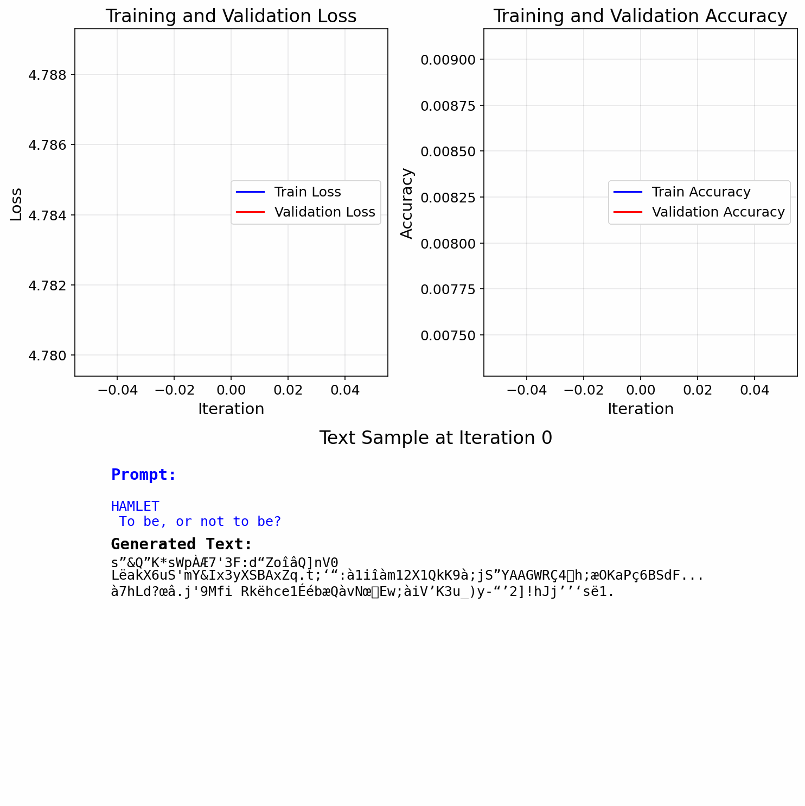
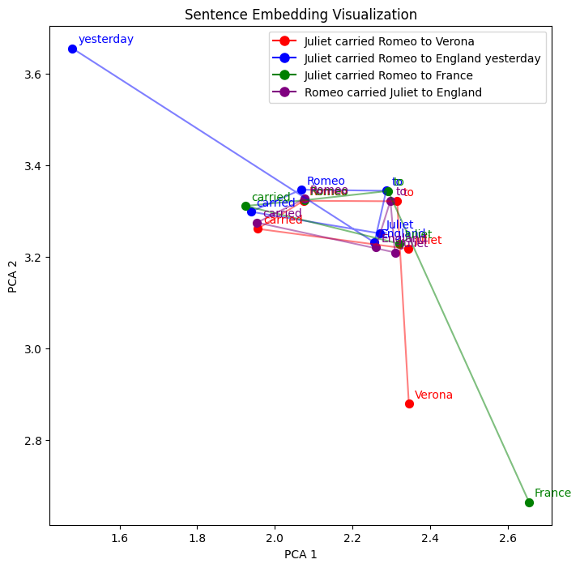

# Transformer Sandbox

A Python project for experimenting with transformer models, featuring a simple implementation of the Transformer architecture and training utilities.
Below, is an animated GIF showing the model's progress over several training examples, for both char-level and word-level tokens:




**What you'll see:**
- **Loss curves** (blue) and **validation loss** (red) decreasing over time
- **Accuracy curves** showing training and validation performance
- **Text samples** generated at each checkpoint using a custom input prompt

The GIF is automatically generated after training completes, showing the complete learning journey from random characters to Shakespeare-like patterns!

## Visualization
The model's word embeddings can be visualized to understand how it represents relationships between words. Below is a PCA (Principal Component Analysis) visualization of word embeddings for a sample sentence prediction task:



The plot above shows the 2D projection of word embeddings for the sentence "Juliet carried Romeo __". Each point represents a word, with similar words clustering together in the embedding space. This visualization helps us understand how the model learns to represent semantic relationships between words during training.

Key observations:
- Related words (like character names) tend to cluster together
- Words with similar grammatical roles show proximity
- The model learns meaningful vector representations that capture both semantic and syntactic relationships


## Project Structure
```
transformer-sandbox/
├── demos/                          # Example notebooks and demonstrations
│   ├── Demo Shakespeare.ipynb      # Shakespeare text generation demo
│   └── Semantic Embeddings.ipynb  # Word embedding visualization demo
├── scripts/                        # Training and execution scripts
│   ├── run.sh                      # SLURM batch script for cluster execution
│   └── example_usage.sh            # Examples of different training configurations
├── networks.py                     # Transformer model implementation
├── runners.py                      # Training and evaluation utilities
├── utils.py                        # Helper functions
├── test.py                         # Comprehensive test suite
├── shakespeare.txt                 # Shakespeare text dataset
├── requirements.txt                # Python dependencies
├── saved/                          # Saved model checkpoints
│   └── shakespeare_transformer_model.pt
├── saved_legacy/                   # Legacy model checkpoints
│   ├── shakespeare_transformer_model.pt
│   └── README.md
├── animation.gif                   # Training progress animation
├── animation_token.gif             # Token-level training animation
├── animation_word.gif              # Word-level training animation
├── embedding.png                   # Word embedding PCA visualization
└── README.md                       # This file
```

## Features
- **Custom Transformer Implementation**: A PyTorch-based transformer model with configurable parameters
- **Training Runner**: Comprehensive training loop with metrics tracking and validation
- **Text Generation**: Inference capabilities for generating text continuations
- **🎭 Shakespeare Demo**: Complete, interactive tutorial for training transformers on literary text
  - Step-by-step character-level text generation
  - Comprehensive data preprocessing pipeline
  - Training visualization and metrics analysis
  - Real-time text generation with custom prompts
  - Optimized for Apple Silicon (MPS) and CPU
- **🔍 Semantic Embeddings Demo**: Interactive exploration of word embeddings
  - PCA visualization of word relationships
  - Understanding semantic similarities in the embedding space
  - Analysis of how the model represents language structure

## Installation

1. Clone the repository:
```bash
git clone <repository-url>
cd transformer-sandbox
```

2. Create a virtual environment (recommended):
```bash
python -m venv .venv
source .venv/bin/activate  # On Windows: .venv\Scripts\activate
```

3. Install dependencies:
```bash
pip install -r requirements.txt
```

4. Verify installation:
```bash
python test.py
```

## Usage

### 🎭 Shakespeare Demo - The Main Attraction

The centerpiece of this project is `demos/Demo Shakespeare.ipynb`, a comprehensive tutorial that demonstrates the full transformer training pipeline:

```bash
cd demos
jupyter notebook "Demo Shakespeare.ipynb"
```

#### What You'll Learn

This interactive notebook walks you through:

1. **Environment Setup**: Automatic device detection (MPS/CPU) and module imports
2. **Data Processing**: Loading Shakespeare text, creating vocabulary, and encoding/decoding functions
3. **Model Architecture**: Building a custom transformer with configurable parameters
4. **Training Process**: Complete training loop with real-time metrics and validation
5. **Visualization**: Training loss/accuracy plots for model analysis
6. **Text Generation**: Creating new Shakespeare-style text from custom prompts

#### Demo Features

- **Character-level generation** for fine-grained text control
- **Interactive training** with progress bars and real-time metrics
- **Customizable prompts** - try your own Shakespeare-style openings
- **Performance optimization** for Apple Silicon Macs
- **Educational explanations** for each step of the process

#### Sample Output

The demo generates text like:
```
Input: "OMELETTE. To fry, or not to fry?"
Output: "TOETHYOSUIW. Ss AXd po, Path phit ive? Y. TSNDHO..."
```

While not necessarily legible, it captures some trends like punctuation and capitalizing names!

### 🔍 Semantic Embeddings Demo

The `demos/Semantic Embeddings.ipynb` notebook provides an interactive exploration of how the transformer model learns to represent words in vector space:

```bash
cd demos
jupyter notebook "Semantic Embeddings.ipynb"
```

#### What You'll Explore

This notebook demonstrates:

1. **Word Embedding Extraction**: How to extract learned word representations from the trained model
2. **PCA Visualization**: Dimensionality reduction to visualize high-dimensional embeddings in 2D
3. **Semantic Clustering**: Understanding how related words cluster together in embedding space
4. **Relationship Analysis**: Exploring how the model captures semantic and syntactic relationships

#### Key Insights

- **Character Names**: Romeo, Juliet, and other characters cluster together
- **Grammatical Patterns**: Similar parts of speech show proximity in embedding space
- **Contextual Understanding**: The model learns meaningful representations that capture Shakespeare's language patterns

### Using the Components Separately

#### Creating a Transformer Model

```python
from networks import Transformer

# Create a transformer with custom parameters
model = Transformer(
    vocab_size=1000,
    embedding_size=32,
    num_heads=3,
    num_layers=1,
    block_size=50,
    dropout=0.1
)
```

#### Training with the Runner

```python
from runners import Runner
import torch.nn as nn
import torch.optim as optim

# Setup training components
loss_fn = nn.CrossEntropyLoss()
optimizer = optim.AdamW(model.parameters(), lr=1e-3)
runner = Runner(model, loss_fn, optimizer, device="cpu")

# Train the model
runner.train(train_data, val_data, batch_size=64, iters=1000)
```

#### Text Generation

```python
# Generate text continuation
generated_text = runner.generate(
    string_input="To be or not to be",
    encode=encode_function,
    decode=decode_function,
    max_new_tokens=50
)
```

### 🚀 Scripts and Utilities

The project includes several utility scripts for different use cases:

#### Example Usage Script
```bash
# View usage examples and configurations
./scripts/example_usage.sh
```

#### Cluster Execution
For SLURM clusters, use the provided batch script:
```bash
# Submit to SLURM queue
sbatch scripts/run.sh
```

## Model Architecture

The transformer implementation includes:
- **Multi-head self-attention** with configurable number of heads
- **Position-wise feed-forward networks**
- **Layer normalization** and **residual connections**
- **Configurable embedding dimensions** and **number of layers**
- **Dropout** for regularization

## Requirements

- Python 3.8+ (tested with Python 3.13.2)
- PyTorch 2.0+
- Matplotlib 3.5+
- Jupyter (for running demos)
- NumPy, SciPy, and other scientific computing libraries

See `requirements.txt` for specific package versions and dependencies.

## Contributing

Feel free to:
- Add new model architectures
- Create additional demos
- Improve the training utilities
- Add new datasets

## License

MIT License

Copyright (c) 2024

Permission is hereby granted, free of charge, to any person obtaining a copy
of this software and associated documentation files (the "Software"), to deal
in the Software without restriction, including without limitation the rights
to use, copy, modify, merge, publish, distribute, sublicense, and/or sell
copies of the Software, and to permit persons to whom the Software is
furnished to do so, subject to the following conditions:

The above copyright notice and this permission notice shall be included in all
copies or substantial portions of the Software.

THE SOFTWARE IS PROVIDED "AS IS", WITHOUT WARRANTY OF ANY KIND, EXPRESS OR
IMPLIED, INCLUDING BUT NOT LIMITED TO THE WARRANTIES OF MERCHANTABILITY,
FITNESS FOR A PARTICULAR PURPOSE AND NONINFRINGEMENT. IN NO EVENT SHALL THE
AUTHORS OR COPYRIGHT HOLDERS BE LIABLE FOR ANY CLAIM, DAMAGES OR OTHER
LIABILITY, WHETHER IN AN ACTION OF CONTRACT, TORT OR OTHERWISE, ARISING FROM,
OUT OF OR IN CONNECTION WITH THE SOFTWARE OR THE USE OR OTHER DEALINGS IN THE
SOFTWARE.

